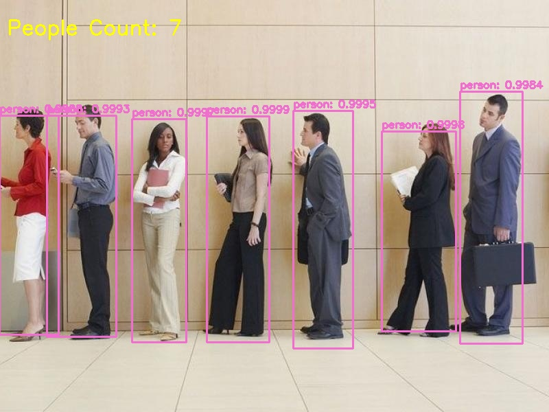
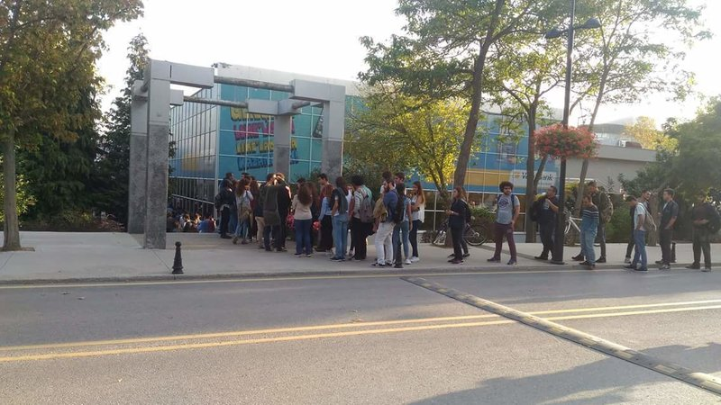
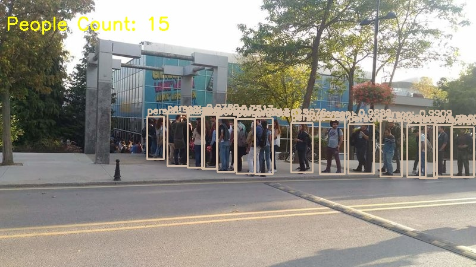

# Queue Analyzer

ITU Computer Engineering Graduation Project: The System that Analyzes the Dining Hall from Security Cameras and Makes Suggestions

## yolov3.weights

There is a file that cannot be added to this repo because its size exceeds the size limit, ***yolov3.weights***. You can download it using this **[link](https://pjreddie.com/media/files/yolov3.weights)**. It should be placed in the ***yolo-coco*** folder.

### Update for weights and config files

Added load methods for weights and config files. Thanks to the ***load_weights_from_url*** method, the weights file can also be added to the project with Python code.

## PeopleDetector Examples

These images are taken from the internet.

Added load methods for weights and config files. Thanks to the ***load_weights_from_url*** method, the weights file can also be added to the project with Python code.

Original | Detected
--- | ---
 | 
 | 
